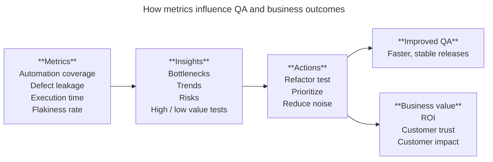

# Stop Guessing: Unlock Test Automation with Metrics

Imagine - you are a Test Automation Engineer in a fast-paced project and you have automated 100 test cases in the last two months. You push your team to speed up releases but then stakeholders ask: “How do you know your automation is actually helping?” This question is more common than you would think, and that's exactly why test automation metrics matter.

## WHY METRICS ARE MORE THAN JUST NUMBERS

Metrics aren't just checklists or dashboards. Done right, they're how QA teams:

* Detect flaky tests before they block a CI/CD pipeline.
* Justify automation ROI to leadership.
* Prioritize what to automate next.
* Know when to stop automating and start refining.

Good metrics turn "We think our automation is working" into "Here's exactly how it's saving us time, bugs, and resources."

## THE RIGHT METRICS FOR THE RIGHT QUESTIONS

Let's break away from theory and look at real-life uses of metrics.

### 1. AUTOMATION COVERAGE

"How much of our regression testing is truly automated?"

**Example:** A travel tech startup tracks automation coverage weekly across business-critical journeys like search, booking and payments. When they realized that only 38% of the flows were automated, they paused UI testing in search area and have rebalanced effort.

**✪ Pro tip:** Don't chase 100%. Aim for critical path coverage first.

### 2. DEFECT LEAKAGE RATE

"What's slipping through our automated safety net?"

**Example:** A healthcare app noticed a spike in post-release bugs. On investigation, they found out that test cases covered login and forms, but not the edge cases of multi-language formatting. By tracking leakage, they updated their coverage strategy.

**✪ Pro tip:** Leakage isn't failure, it's feedback.

### 3. EXECUTION TIME & TEST THROUGHPUT

"Are our tests fast enough for continuous delivery?"

**Example:** A gaming platform uses 15 parallel test runners but release bottlenecks still kept happening. Metrics showed that 20% of tests ran sequentially due to environmental locks. Refactoring shaved off 40 minutes per build.

**✪ Pro tip:** Speed is valuable but reliability makes tests release-ready.

### 4. TEST EFFECTIVENESS (Defects per Test Case)

"Which test cases are actually catching bugs?"

**Example:** A QA lead tags each defect found with the test case that caught it. Over time, this exposed that 12% of their scripts had never caught a single bug in over a year. Those tests where rewritten or retired.

**✪ Pro tip:** Retire low-impact tests. Focus on high-value ones.

### 5. TEST FLAKINESS RATE

"Why do our tests fail… then pass… with no changes?"

**Example:** A team at a media streaming platform ran nightly regression. When flakiness spiked past 30%, they traced it to an external service with rate limits. They eliminated dependency and restored trust in their tests.

**✪ Pro tip:** Flaky tests cost more than failures, they undermine credibility.

## QUICK GUIDE: How to Calculate Common QA Automation Metrics

While metric definitions are conceptually consistent across teams, the way you calculate them can vary depending on the tools you use, your CI/CD setup, data availability, and even how your team defines success. This quick guide offers general formulas and practical notes based on real-world QA practices.

These formulas are adaptable depending on your context. What matters most is consistency over time, so you can detect trends.

| Metric | Formula | Details / Notes |
| :--- | :--- | :--- |
| Automation Coverage | (Number of Automated Test Cases / Total Number of Test Cases) | Counts all automated test cases for a defined scope (e.g., regression suite, critical path). Be consistent in how you count manual vs automated. |
| Defect Leakage Rate | (Number of Post Release Bugs / Total Number of Bugs Found) | Post-release bugs = bugs found in production. Total bugs = pre-release (QA phase) + post-release. Helps track what slipped past all QA efforts. |
| Execution Time | (Total Execution Time / Number of Suite) | The average amount of time it takes for a test suite (or job) to run from start to finish. For example, if 5 test suite runs take a total of 250 minutes, average execution time is 50 minutes per run. |
| Throughput | (Number of Suite Runs / Time Period) | The number of test suite runs your system can complete in each period (e.g., per hour, per day). For example, if your CI/CD pipeline executes 30 test suite runs in a workday, throughput is 30 runs/day. |
| Test Effectiveness | (Number of Defects Found by a Test Case / Times the Test Case was Executed) | Use tagging in your defect tracker or automation logs. Helps identify low-value tests that rarely (or never) find bugs. |
| Test Flakiness Rate | (Number of Flaky Failures of the Test / Total Test Executions) | A flaky failure = a test that fails and then passes without any code or data change. Track them per build and tag the cause if possible (e.g. environment, async). |

## HOW DATA DRIVES QA DECISION-MAKING

This flowchart illustrates the journey from raw test automation metrics to meaningful organizational outcomes. By collecting and analyzing metrics such as coverage, defect leakage, execution time and flakiness rate, QA teams gain actionable insights. These insights guide decisions about which tests to prioritize, refactor or retire. In turn, the resulting actions improve reliability, speed and focus within the pipeline, reinforcing QA strategy and strengthening business confidence.

Figure 1. The flow illustrates how QA metrics generate insights that drive actions, leading to improved software quality and significant business value. Source: Own elaboration

## METRICS ONLY MATTER WHEN THEY CHANGE BEHAVIOR

It's easy to create beautiful dashboards that no one looks at. What separates effective QA teams is this:

* They use metrics to make decisions.
* They reprioritize automation based on results.
* They remove noisy metrics and add insightful ones.

### WHEN METRICS CAN HELP YOU

* They can make your testing strategy visible and defensible.
* They can reduce arguments about "gut feeling" with real data.
* They can help QA speak the language of business (ROI, risk, speed).

### WHEN METRICS CAN HURT YOU

* If they become a vanity scoreboard (e.g., "we have 1,000 automated tests!").
* If teams automate just to improve a number.
* If metrics are misused in performance reviews.

## HOW TO USE METRICS WITHOUT LOSING YOUR MIND

* Pick 3 - 5 metrics that support your current QA goals. Not more.
* Track them consistently. Manual tracking dies fast. Use tools.
    * *Popular tools like Allure, TestRail and Jenkins plugins can make metric tracking seamless. Choose the ones based on your stack and integration needs.*
* Review them with your team. Metrics spark collaboration.
* Drop any metric that doesn't change your behavior.
* Ask "So what?" after every metric. If there is no clear action, refine it.

## FINAL THOUGHTS: Automation Without Metrics Is Just Blind Testing

If you don't measure, you are guessing. And in QA, where quality, speed and trust intersect, guessing is expensive.

Use metrics to focus your energy, guide your decisions and prove your impact. Because the next time someone asks, "What's the value of your automation?", you won't just have an answer, you will have a story backed by numbers. Start by picking one metric today, track it for a sprint and see what changes.
