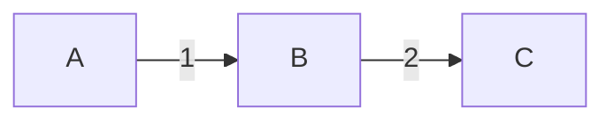
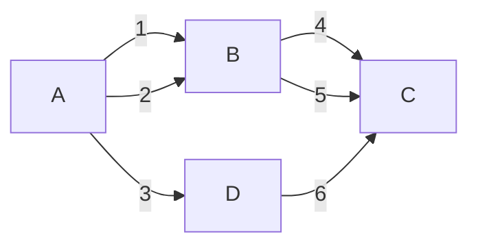
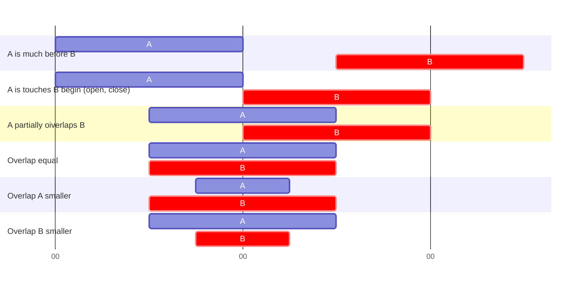
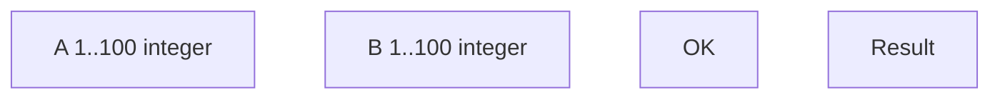

# Test case writing in practice

## Előszó :-)

- A TC készítés (írás) képessége egy nagyon fontos, gyakorlatilag alap dolog.
- E nélkül igazából egy tesztet sem lehet végrehajtani. 
- Ha nem készülünk fel egy teszt végrehajtására, akkor igazából csak nyomkodunk össze-vissza. Amikor egy tesztet végrehajtunk, a fejünkben akkor is először készítünk egy TC-t, csak nem írjuk le. 
- Pl: Megnyomom a "File" gombot. Majd az "Edit" gombot és így tovább. Ilyenkor is megvannak a TC lépései, csak nem fogjuk fel. (Mintha ösztönösen nyomkodnánk.) És mindaddig, amíg a nyomkodások közben azt kapjuk, amit ösztönszerűen elvártunk, föl sem tűnik, hogy egy-egy adott lépésnek van elvárt eredménye. Csak akkor kezdjük érzékelni a dolgot, amikor nem azt kapjuk, amit elvártunk. ...

## Tesztelések típusai

- Functional
- System
- Regression
- Performance (load, stress)
- Modul / Unit
- etc
- Black Box  (a rendszer kívülről – vagyis a User Interface-en keresztül történő tesztelése)
- White Box (a rendszer illetve egy-egy funkció belülről történő tesztelése, változók ismerete, függvények hívása – függvény output elemzése)

## Hogyan essünk neki – Dekompozició

- Célszerű a funkcionális részek mentén felosztani
  - Menübejárás
  - Képernyők
  - Settings
  - Menüből elérhető funkciók
  - Máshonnan elérhető funkciók
  - etc

## Felosztás után – Mi legyen az apró darabokkal 

### Linear / simple pieces and transitions

What need to be tested:

- A
- 1 (A --> B) The transition form A to B
- B
- 2 (B --> C) The transition form B to C
- C

----

### More complicated pieces and / or transitions

What need to be tested:

The functions and transitions like before. 
But now we can reach C from A in 5 ways: 
- 4 ways from through B
  - 1 (A --> B) --> 4 (B --> C)
  - 1 (A --> B) --> 5 (B --> C)
  - 2 (A --> B) --> 4 (B --> C)
  - 2 (A --> B) --> 5 (B --> C)
- and 1 way through D
  - 3 (A --> D) --> 6 (D --> C)

If the behavior of B and C does not depend on the way we achieved them, then we do not need to test all combinations, just select one, or few.
Using Cartesian product these transitions / behaviors / flavors would have a very big number of combinations. (Writing and also executing so much cases costs huge time)

### What to do with the smaller pieces

Következhet az apróbb darabok további analízise.

Kijelöljük az objektumokat és a funkciókat, tulajdonságokat (ha van doksi, ezt megtehetjük oly módon, mint ahogy régen a mondatokat elemeztük: a különböző dolgokat különböző jelölésekkel látjuk el.) Pl.: 

The ==menu== appears on the **top**

- One test case should check one thing
- In automated testing ususally it is more cost efficient to check more things at one time

## Positive test cases (TCs)

- Már az analízis során fel kell állítani a pozitív és negatív TC-k halmazát.
- Pozitív TC: A normál működés ellenőrzésére irányul
- Összegyűjtésük viszonylag egyszerű: A dokumentációból ill. a requirementekből történik. For example the mentioned menu appearance 
- "Mindent meg kell nyomni, ki kell próbálni"

## Negative test cases (TCs)

- Negatív TC: Célja a program kiakasztása, megtörése, lefagyasztása stb. Jobb ha mi vesszük észre a hibát, mint az ügyfél. (Ezért vagyunk.)
- Ezeket nem lehet „összegyűjteni”, ezeket kreatívan ki kell találni. Végig kell gondolni az összes lehetséges esetet. 

(first example: Van két szakaszunk egy számegyenesen. …)

second example

A lenti form egy számítást végez. A és B a kiírás szerint 1 és 100 közé eső egész szám kell legyen. Mondjunk néhány negatív TC-t az esetre. (Érdemes megfigyelni a negatív és pozitív TC-k arányát.)

## How to write?

- "Utcáról bejőve" is végre lehessen hajtani (legalábbis egy test-set elején)
- 1 TC –> 1 funkció
- 1 Step –> 1 mozzanat (1 esemény stb)
- Minden lépésnek van elvárt eredménye (!)
- Lépéseket, és elvárt eredményeket mindig pontosan, precízen kell megfogalmazni

## Test Case-ek rendezése

- Könyvtár (mappa) struktúrában történik a dekompozíció (darabolás) eredményének megfelelően
- A mappákat célszerű logikailag sorba tenni és ennek a sorrendnek megfelelően beszámozni. Ez könnyebb kezelhetőséget, és jó olvashatóságot biztosít, ugyanakkor láttatja a tesztelt alkalmazás felépítését

## Settings

- "Különleges" dolog, mivel nem csak egy egyszerű menüpontról van szó, ami valahogy végrehajtódik
- Meg kell vizsgálni, hogy a beállítás érvényesült-e
- Meg kell nézni, hogy tényleg elmentődik-e (legalábbis a permanens beállítás)

For example

Beállítás: A háttér legyen piros
1. Piros lett a háttér? 
1. Kilépek a menüből, belépek, megmaradt a beállítás? 
1. Kikapcsolom, bekapcsolom; megmaradt a beállítás? 
1. Most is piros még a háttér?

### Default settings

- Első ránézésre igazi különlegességet nem tartogat, de érdemes megvizsgálni a következőket:
- A "szűz" programban meg kell nézni, hogy a beállítások az igényelt beállításokkal egyeznek-e
- Restore default / factory reset után ugyanezeket kell vizsgálni

## Test Case-ek írása – Tartalom

- Minden TC egy önálló egység. (!) Tehát nem lehet azt írni, hajtsd végre az akármelyik másik TC-t, majd folytasd…
- Ilyen esetben például lehet használni template-et

## Test Case-ek írása – Külső forma

- Ha egy file egy TC-t tartalmaz, könnyen szervezhetjük, másolhatjuk a file rendszerben. Másolás helyett rakhatunk csak linket a file-ra (a duplikálás sok baj forrása lehet)
- Természetesen a TC-ket tartalmazó mappákhoz hasonlóan magukat a TC-ket is célszerű számozni. A logikai sorrend mutatása mellett arra is lehetőséget biztosít, hogy a TC-ket átnevezzük a sorrend megtartása mellett
- A szerkeszthetőséget és a végrehajtás naplózhatóságát figyelembe véve (ha nem rendelkezünk külön TC kezelő eszközzel) praktikusan kezelhetjük a TC-ket excelben
- Lehet használni word táblázatot is; ennek fő ereje a szépíthetőségben van. Ha az ügyfél nem technikai emberének kell riportot adni, hasznos lehet

## Test Case-ek írása – Belső forma

- Minden TC-nek van neve (name) és leírása (description)
- Lépéseknek: sorszáma, leírása (descreption), elvárt eredménye (expected result), eredmény (végrehajtáskor kerül megadásra) (result), és megjegyzés (comment)
- Opcionálisan előfordulhatnak feltétel illetve követelménybiztosító, konfigurációbeállító lépések

## TC Végrehajtása

- A lépések és egyúttal a TC eredménye lehet sikeres (Passed), vagy hibás (Failed)
- Ha akár csak egy lépés is Failed, akkor az egész TC failed lesz
- Előfordulhat olyan, hogy egy hibás eredményt adó (NEM HIBÁS!) lépés után is folytatjuk a TC-t. pl.: fordítás ellenőrzésénél, nem állunk egy hibás fordításnál, mert szükségünk van az összes hibás fordításra

## Apróbb tippek trükkök 
- Ha néhány gomb megnyomása ugyanazt az eredményt adja (pl. negatív TC-k esetén lehetséges), lehet olyanokat írni, hogy pl. "Nyomd meg az '1', '2', '3' gombok valamelyikét"
- Ezzel egy kis szabadságjogot is adva a végrehajtónak 
  - FIGYELEM: Ezzel nem lesz teljes a lefedettség, de néha ez nem is szükséges, viszont sokkal kevesebb a munka minden területen (TC írás, TC ellenőrzés, TC végrehajtás)
- Ha egy sok tesztből álló teszt tervet (test suite) készítünk, elégséges lehet az, ha az elején csak egyszer írjuk le egy adott funkcióelérés minden egyes gombnyomását. Utána a elég ha azt írjuk, hajtsd végre az adott funkciót
- Nem trükk, de figyeljünk oda, hogy ne képzeljünk bele a doksiba …
- Írhatunk olyat az expected result-ba, hogy "Appropriate (error) message is displayed" (nem kell pontosan odaírni a szöveget, ráadásul az változhat is)
- Néha szükség lehet arra, hogy valamire erősen felhívjuk a teszt végrehajtójának figyelmét ("Check if…")
  - A "Check if" kezdetű lépések könnyen szerkeszthetők
- Szintén nem trükk, inkább munkamenet: Ha egy (beszámozott) Test Suite-et már "kiadtunk" és annak elemeire már történtek hivatkozások (levelezésben, vagy egyéb dokumentálásban), és törölni kell belőle, a maradékot NE számozzuk át, mert nem fogják megtalálni

## How to create test frameworks - how to avoid hard situations
(this is what I learned during several years)
- Test case shoulod know and control everything: no smart low level stuff: no "I will find out things" in low level, because situations can change, and for example if a different server is needed or a different way of working, then everything must be rewritten; example sturcture 
  - Test case
    - get config
    - get machines
    - set way of working
    - call low level functions with the above as parameters, or set these to some kind of non-local parameters
    - low level functions can have some reasonable default parameters for the above, for example login as admin credentials. This way the test cases do not need to pass these stuff again and again, which makes the code smaller and more readable 
- functions and wrappers must allow passing them / passing through bad data to enable testing the negative cases
- wrappers should allow pass-through all parameters of the wrapped stuff (*args, **kwargs). For example requests has many parameters, and similarly it passes through them to lower level libraies too. (That is to follow the changing of the need)

